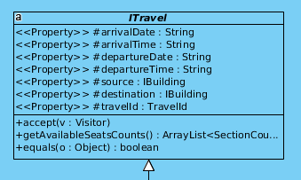
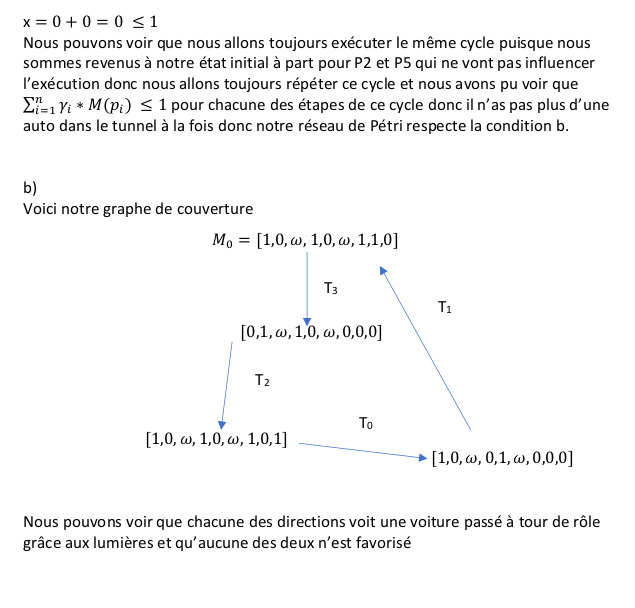

# Analyse et Conception - TP3
## Note:
*This is the final project for the course "Software Design and Analysis" (IFT 3911) at Université de Montréal. I did this project with 3 teammates whose identities I have hidden for their privacy. The premise of this project was to implement, in groups of 4, a project design from a previous assignment that had been done in groups of 2. Consequently, I only made small contributions to the design of this project, since my partner (teammate 3) and I had made a parallel design for the previous assignment. Rest assured, I did my part of coding (otherwise I wouldn't have posted this). I am keeping this on my GitHub portfolio to serve as an example of a large project that I worked on, for those who are interested in seeing an example of my code. I have indicated sections that I authored below:*
*

---
## Comment rouler l'application
Une fois l'application lancée, vous aurez 3 options:

1. Entrez 'admin' pour se logger sur linterface admin
2. Entrez le clientID pour se logger sur l'interface client (1, 2 ou 3)
3. exit pour fermer l'application

* Voir les commandes affichées a l'ecran et / ou tapez help pour voir les commandes disponibles.

---

  
<b>Table des matières</b>

  <ul>
    <li><a href="#design-logiciel">Design logiciel</a>
        <ul>
            <li><a href="#fabrique">Fabrique</a>
                <ul>
                    <li><a href="#sequence-pour-fabrique">Sequence pour fabrique</a></li>
                    <li><a href="#diagramme-de-classe-pour-fabrique">Diagramme de classe pour fabrique</a></li>
                </ul>
            </li>
            <li><a href="#singleton">Singleton</a>
                <ul>
                    <li><a href="#sequence-pour-singleton">Sequence pour Singleton</a></li>
                    <li><a href="#diagramme-de-classe-pour-singleton">Diagramme de classe pour Singleton</a></li>
                </ul>
            </li>
            <li><a href="#etat">Etat</a>
                <ul>
                    <li><a href="#sequence-pour-etat">Sequence pour Etat</a></li>
                    <li><a href="#diagramme-de-classe-pour-etat">Diagramme de classe pour Etat</a></li>
                </ul>
            </li>
            <li><a href="#observateur">Observateur</a>
                <ul>
                    <li><a href="#sequence-pour-observateur">Sequence pour observateur</a></li>
                </ul>
            </li>
            <li><a href="#commande">Commande</a>
                <ul>
                    <li><a href="#sequence-pour-commande">Sequence pour commande</a></li>
                    <li><a href="#diagramme-de-classe-pour-commande">Diagramme de classe pour Commande</a></li>
                </ul>
            </li>
            <li><a href="#visiteur">Visiteur</a>
                <ul>
                    <li><a href="#sequence-pour-visiteur">Sequence pour visiteur</a></li>
                    <li><a href="#diagramme-de-classe-pour-visiteur">Diagramme de classe pour visiteur</a></li>
                </ul>
            </li>
            <li><a href="#diagramme-de-classes-logiciel">Diagramme de Classes logiciel</a></li>
            <li><a href="#diagramme-de-paquet">Diagramme de paquet</a></li>
        </ul>
    </li>
    <li><a href="#qualite-de-conception">Qualite de conception</a></li>
    <li><a href="#reseau-de-petri">Reseau de petri</a></li>
    <li><a href="#distributions-des-taches">Distributions des taches</a></li>
    </ul>

## Design logiciel

**Note:** les diagrammes de classes des patrons montrés ici sont comme ils apparaissent dans notre design, parfois par contrainte de lisibilité (liens relationnels mineurs manquants). Le design de chaque patron est cependant comforme à celui vu dans les notes de cours, comme cela peut être observé dans le code.

### Fabrique

#### Sequence pour fabrique

Voir le diagramme de séquence du patron de commande:
on y trouve un exemple d'utilisation d'une fabrique.

#### Diagramme de classe pour fabrique

### Singleton

#### Diagramme de classe pour Singleton

Le CommandManager ne possède qu'une seule instance accessible à l'aide de getInstance() (non montrée).

### Etat

#### Sequence pour Etat

Exemple d'un changement d'état: supprimer une réservation met le siège dans l'état Available.

#### Diagramme de classe pour Etat

Les différents possibles d'un siège héritent d'une classe abstraite. Le siège possède un de ces trois états en attribut.

### Observateur

#### Sequence pour observateur

#### Diagramme de classe pour Observateur

### Commande

#### Sequence pour commande

Ce diagramme montre un exemple d'utilisation de commande (créer un port) et de fabrique (CruiseManager qui implémente la fabrique de ports).

#### Diagramme de classe pour Commande

Seules deux commandes sont montrées ici.

### Visiteur

#### Diagramme de classe pour visiteur

La classe ITravel prend la place de IVisitable et accepte un des deux visiteurs possibles (admin ou client) avec sa méthode accept(Visitor v)

### Diagramme de Classes logiciel
***Voir projet Visual Paradigm, diagramme trop gros pour être affiché.***
### Diagramme de paquet

---------------

## Discussion

* Héritage:
    - Le nouvel arbre d’héritage des Sections, où les classes Section concrètes héritent uniquement des superclasses abstraites et des interfaces PriceModifier, ainsi respectant plus le *Dependency Inversion Principle*
    - L’arbre d’héritage des sièges et cabines est plus conforme aux paradigmes de design, et donc engendre moins de problèmes. Cependant, le Liskov Substitutability Principle a été violé à quelques endroits, notamment dans le patron Visiteur et dans le patron Fabrique de la création des sièges.
    - Afin d’avoir une meilleure cohésion, le contrôleur unique qu’il y avait dans le design du devoir 2 a été remplacé par plusieurs classes concrètes qui héritent toutes d’une même interface. Par exemple un contrôleur pour la création de port et un contrôleur pour la modification des compagnies de vol. Cela fait en sorte qu’il y a maintenant un nombre important de classes concrètes. Néanmoins, cela est un meilleur design puisqu’il évite la présence d’un « god class » monolithique qui contient absolument toutes les fonctions de modification de données.
    - L’arbre d’héritage de la classe State, où nous nous sommes abstenus de inclure des méthodes en commun entre les classes concrètes, afin de ne pas violer le Principe de Liskov.

* Observateur:
    - Nous avons utilisé la version “push” de l’observateur.
    - L’observateur possède un manager qui permet aux observateurs d’observer plusieurs sujets à la fois. Cela n’est pas utilisé, mais rend le design plus réceptif aux changements futurs.
    - Les attributs PriceModifier et getPriceModifier sont pas dans le même arbre d’heritage; toutes les sous-classes concrètes de Section héritent d'un attribut priceModifier qui est un arbre à part, et le getPriceModifier provient de l'arbre principal. Cela nous permet de faire en sorte que getPriceModifier soit accessible pour toutes les Sections.
    - Notre conception d'interface en CLI fait en sorte qu'on ne se sert pas du tout de la notification qui provient du sujet, mais elle est conçue de façon à ce qu’elle soit prête à intégrer une éventuelle GUI.

* Visiteur:
    - Léger manque d’abstraction dans la manière de créer les Strings parfois un peu redondante.

* Commande:
    - On utilise la variation avec command manager qui implémente un stack pour le undo.
    - Chaque commande est une classe à part, ce qui rend le package lourd, mais nous n’avions pas le choix étant donné qu’ils prennent des arguments différents.

* Singleton:
    - Aucune variation particulière, on a fait passer nos registres qui étaient des classes static en mode singleton pour respecter le plus possible le patron.
* Fabrique:
    - On utilise la version “Méthode de fabrication” qui délègue l’instanciation à une sous-classe.
* Demeter:
    - Dans le context de l’interface de ligne de commande, il y a des cas où nous devons accéder à des informations d’autres paquets. Afin de respecter la Loi de Demeter, tous ces accès sont faits à travers de ces classes voisines, AdminController et ClientController.
* Antipatron:
    - Il y a parfois confusion entre SeatType et SeatTypable (abstraite), mais étant donné qu’il s’agissait d’une partie du design faite rapidement et sans y penser beaucoup, le code fait partie du programme sans être nécessairement utile, ce qui en fait une coulée de lave.
* Divers:
    - Dans l’ancien design, les registres de voyages, de clients, etc. avaient un espace d’état plus grand leur superclasse, ainsi violant la contra-variance. Nous avons rectifié ce problème en les rendant des classes non-liées.
    - Davantage de fabriques et de singletons ont été faits que demandés.
    - Plusieurs problèmes de conception du DM2 ont été réglés par le simple ajout des patrons demandés. Le package Admin, notamment, est devenu beaucoup plus simple avec le patron de commandes.

--------

## Reseau de petri

### Preuves

## Distributions des tâches
**Temps investi:**

* Coéquipier 1: 25h
* Coéquipier 2: 25h
* Adam: 25h
* Coéquipier 3: 20h

| Tâche                                | Coéquipier 1 | Coéquipier 2 | Coéquipier 3 | Adam |
| ------------------------------------ | ---- | ------ | ------- | ---- |
| Design logiciel                      | 45%  | 45%    | 0%      | 10%  |
| Réseaux de pétri                     | 0%   | 100%   | 0%      | 0%   |
| Programmation                        | 25%  | 25%    | 25%     | 25%  |
| Discussion                           | 25%  | 25%    | 25%     | 25%  |
| Rapport                              | 0%   | 0%     | 50%     | 50%  |
